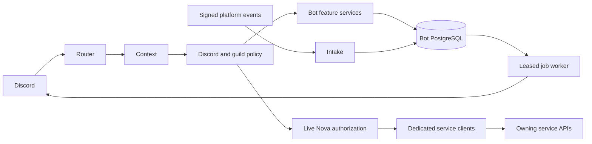

# Architecture

## Commands and context

`src/types/command.types.ts` defines argument metadata, subcommands, access policy, cooldowns, prefix aliases, autocomplete and explicit public-response opt-in. `materializeCommand` creates the Discord registration from that metadata. Module filenames use letters, digits, underscores, dots or dashes; generated declarations and numbered filesystem copies with spaces are ignored. The loader rejects duplicates and resolves modules relative to its own source/compiled directory. There is one canonical entrypoint, `src/index.ts`; legacy entrypoints delegate to it.

`handleCommand` acknowledges slash interactions promptly, constructs context, normalizes prefix/slash arguments, validates values, checks guild policy and Discord permissions, applies cooldowns/maintenance and performs live Nova authorization before executing the command. Replies edit an existing deferred response; follow-ups retain private visibility. Prefix replies cannot be ephemeral. Private service commands reject prefix execution. Allowed mentions default to empty.

Context provides user/member/guild/channel, typed getters, callable arguments, replies/defer/edit/follow-up, media helpers, settings and verified identity. Raw interactions remain available for specialized modal/component APIs. Autocomplete has its own interaction contract, local policy checks and live Nova authorization where data is private. Context menus are not registered because the retained features have command/component interfaces; future menus require an explicit specialized router.

Button/menu/modal registries match exact IDs or delimited descendants, preferring the longest registered prefix. Feature callbacks must recheck current permissions, ownership, guild and configuration; a displayed button is not authorization. The config UI embeds its revision and rejects stale edits. Poll voting binds the originating message and guild. Help navigation binds the requesting user and re-filters visibility.

## Domain boundaries

Feature modules under `src/features/` own local behavior; commands remain thin. PostgreSQL is accessed only for bot-owned domains. Typed settings use a JSON shape with range/reference validation and optimistic revisions. Relational domain tables define explicit guild/user keys and constraints. Reviewed SQL migrations in `drizzle/` are authoritative; Drizzle models cover settings and legacy adapters, while domain services use typed parameterized SQL. Do not generate a replacement schema from the partial Drizzle model.

Settings are cached for five seconds, cloned on reads, bounded to 1,000 guilds and invalidated on writes. Authorization grants are not cached. Help metadata/command registrations are immutable for the process lifetime. Automod counters and cooldowns are bounded in-memory heuristics, not persistent disciplinary records.

## Jobs and startup

Persistent jobs use `FOR UPDATE SKIP LOCKED`, renewable leases, attempt limits, fencing tokens and exponential retry. Unknown job kinds fail visibly. Final expired leases become failed jobs. Successful delivery clears payloads; daily maintenance removes expired OAuth state/sessions, old AFK status, completed/cancelled jobs after seven days, failed payloads after seven days and failed jobs after thirty days. Notification event deduplication lasts thirty days.

Worker handlers must be idempotent or explicitly account for external uncertainty. Discord message nonce enforcement reduces immediate duplicate sends; a crash after delivery but before database acknowledgement can still duplicate a later retry. Do not promise exactly-once delivery across PostgreSQL and Discord. Moderation records a pending case before its effect and never blindly replays uncertain actions.

Readiness requires a ready Discord client and a successful database query. Liveness only reports process availability. Shutdown stops intake readiness, presence/music and job polling, drains current work and closes Discord/database connections with a 25-second deadline. Discord.js manages normal gateway reconnection. Run one gateway process per bot token; database leasing is not a substitute for gateway sharding design.

## Add a feature

1. Define a focused service with explicit input validation and ownership boundaries.
2. Add command metadata and declarative access requirements. Default to private replies for sensitive output.
3. Register components at feature initialization and re-authorize every callback.
4. Add reviewed SQL migrations for durable data, with guild predicates on every guild-owned operation.
5. Test security/failure boundaries and regenerate the command catalog.
6. Update the matching Obsidian feature and integration pages.
